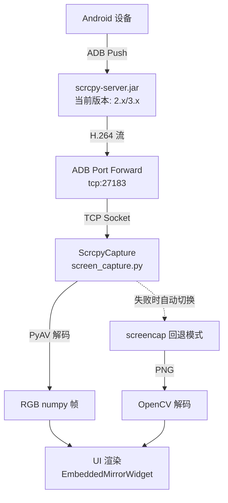
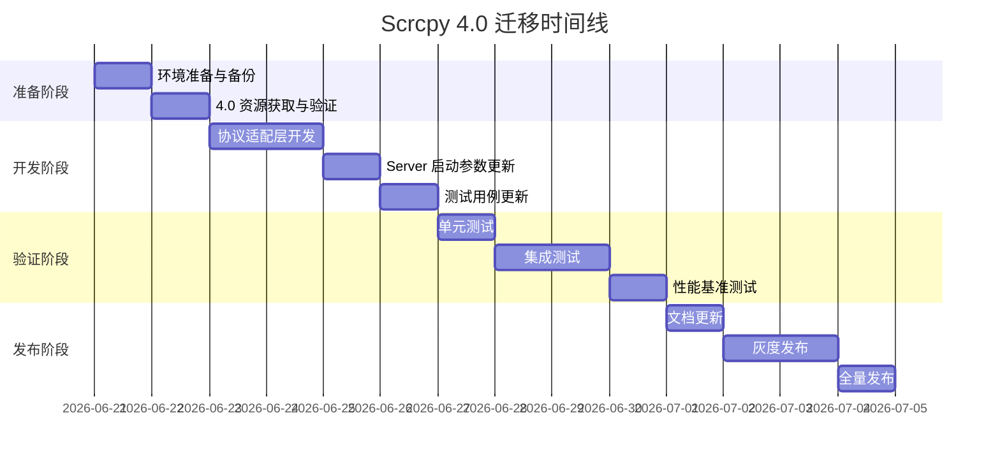
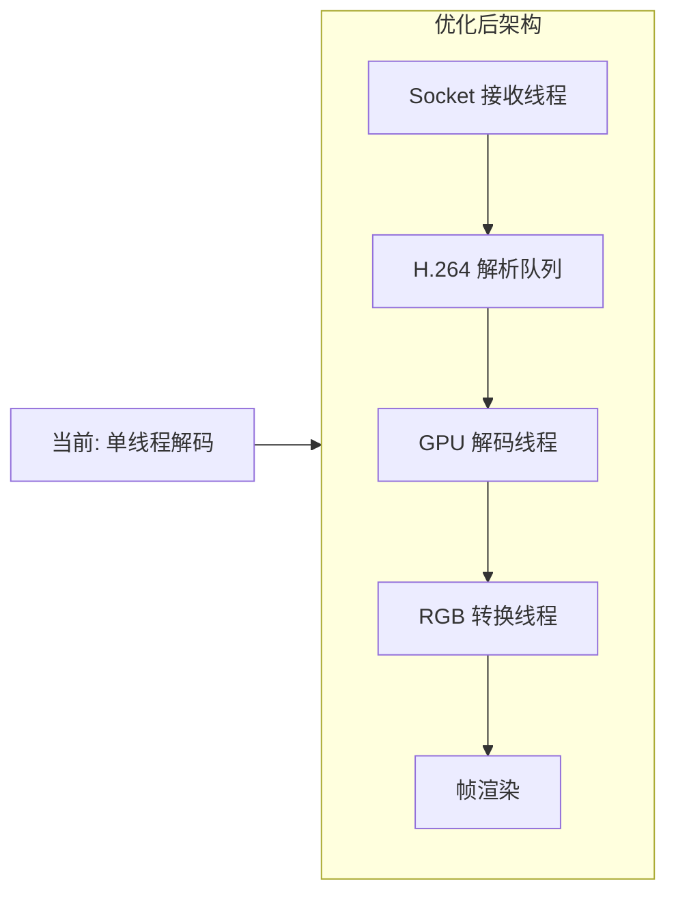

# Scrcpy 4.0 迁移实施方案

> **文档版本**: 1.0
> **创建日期**: 2026-06-21
> **目标版本**: scrcpy 4.0
> **当前版本**: scrcpy 2.x/3.x (兼容模式)

---

## 一、迁移目标与范围

### 1.1 迁移目标

| 目标类别 | 具体描述 | 验收标准 |
|---------|---------|---------|
| **功能兼容性** | 确保现有屏幕采集功能在 scrcpy 4.0 下正常运行 | 所有现有测试用例通过，投屏帧率稳定 |
| **性能提升** | 利用 scrcpy 4.0 的性能优化降低延迟和 CPU 占用 | 首帧时间 < 2s，平均延迟降低 ≥10% |
| **新特性支持** | 可选性地集成 scrcpy 4.0 新特性（Flex Display、相机控制等） | 按需启用新功能模块 |
| **代码现代化** | 清理 2.x/3.x 兼容代码，统一为 4.0 协议处理 | 移除旧版协议分支逻辑 |

### 1.2 迁移范围

#### 包含范围

- [x] 核心采集模块：[screen_capture.py](file:///d:/Github/PY/core/screen_capture.py)
- [x] Server 资源文件：`lib/scrcpy-server.jar` → 升级到 4.0 版本
- [x] 客户端工具：`lib/scrcpy-win64/` 目录下的可执行文件
- [x] 单元测试：[test_screen_capture.py](file:///d:/Github/PY/tests/test_screen_capture.py)
- [x] 配置管理：[config.json](file:///d:/Github/PY/config/config.json) 中的 `scrcpy_server_path` 字段
- [x] UI 组件：投屏相关组件的兼容性验证
- [x] 文档更新：[cast-acceptance.md](file:///d:/Github/PY/docs/cast-acceptance.md)

#### 不包含范围（后续迭代）

- ~~SDL2→SDL3 迁移~~（项目不使用 SDL，仅使用 Python socket + PyAV）
- ~~官方客户端替换~~（保持自定义客户端实现）
- ~~音频转发功能~~（当前未使用 audio=true）
- ~~相机控制功能~~（可选增强，非必须）

---

## 二、当前环境评估

### 2.1 技术栈现状

```
项目类型:     Python 3.x + Qt5 桌面应用
核心依赖:
  ├── PyQt5 >= 5.15, < 5.16        # UI 框架
  ├── numpy >= 1.24, < 2.0         # 数值计算
  ├── opencv-python >= 4.8, < 5.0  # 图像处理（screencap 回退）
  ├── PyAV (av)                    # H.264 解码器
  └── Pillow >= 10.0, < 11.0       # 图像处理

Scrcpy 集成方式: 自定义 Socket 客户端（非官方 CLI 封装）
协议支持:     2.x + 3.x 自适应检测
数据流:       scrcpy-server.jar → ADB forward → TCP Socket → H.264 → PyAV → RGB numpy
回退方案:     adb exec-out screncap -p → PNG → OpenCV → BGR numpy
```

### 2.2 当前实现架构图



### 2.3 关键文件清单

| 文件路径 | 作用 | 变更影响等级 |
|---------|------|------------|
| [core/screen_capture.py](file:///d:/Github/PY/core/screen_capture.py) | 核心 scrcpy 客户端实现 | **高** - 必须修改 |
| [lib/scrcpy-server.jar](file:///d:/Github/PY/lib/scrcpy-server.jar) | 服务端 JAR 包 | **高** - 必须替换 |
| [lib/scrcpy-win64/](file:///d:/Github/PY/lib/scrcpy-win64/) | Windows 客户端工具 | **中** - 建议更新 |
| [tests/test_screen_capture.py](file:///d:/Github/PY/tests/test_screen_capture.py) | 单元测试 | **中** - 必须更新 |
| [config/config.json](file:///d:/Github/PY/config/config.json) | 配置文件 | **低** - 可能调整 |
| [docs/cast-acceptance.md](file:///d:/Github/PY/docs/cast-acceptance.md) | 验收文档 | **低** - 必须更新 |

### 2.4 当前版本检测机制

当前代码实现了三级版本检测（见 [screen_capture.py:59-167](file:///d:/Github/PY/core/screen_capture.py#L59-L167)）：

1. **`_detect_scrcpy_version()`**: 从 `scrcpy --version` 命令获取客户端版本
2. **`_detect_server_jar_version()`**: 从 JAR 文件的 MANIFEST.MF/.dex 提取服务端版本
3. **`_parse_major_version()`**: 提取主版本号用于协议分支判断

---

## 三、Scrcpy 4.0 新特性与兼容性分析

### 3.1 核心变更清单

| 变更项 | 类型 | 对本项目的影响 | 应对策略 |
|-------|------|--------------|---------|
| **SDL2 → SDL3 迁移** | 架构变更 | **无直接影响** - 项目不使用 SDL，仅用 Python socket | 无需修改 |
| **协议格式可能变化** | 潜在破坏性 | **需要验证** - 头部解析逻辑可能需要调整 | 见 3.2 节详细分析 |
| **Server 启动参数变化** | API 变更 | **可能影响** - `_start_server_process()` 的参数列表 | 需要对比验证 |
| **新依赖版本要求** | 环境变更 | **需要确认** - adb 37.0.0, FFmpeg 8.1.1 | 更新环境检查逻辑 |
| **Flex Display 功能** | 新增功能 | **可选集成** - 动态虚拟显示尺寸 | 作为增强模块实现 |
| **相机控制功能** | 新增功能 | **可选集成** - 手电筒/变焦控制 | 作为增强模块实现 |
| **窗口宽高比锁定** | UI 增强 | **不适用** - 使用自定义 Qt 渲染 | 无需修改 |
| **Bug 修复集合** | 质量 | **正面影响** - 修复多个已知问题 | 自动受益 |

### 3.2 协议兼容性深度分析

#### 当前支持的协议格式

**2.x 协议头部** ([screen_capture.py:618-619](file:///d:/Github/PY/core/screen_capture.py#L618-L619)):
```
[1 byte dummy][64 bytes device name][4 bytes width][4 bytes height]
```

**3.x 协议头部** ([screen_capture.py:619](file:///d:/Github/PY/core/screen_capture.py#L619)):
```
[1 byte dummy][64 bytes device name][4 bytes codec_id][4 bytes width][4 bytes height]
```

#### 4.0 协议预测与风险点

> ⚠️ **注意**: 截至本文档编写时，scrcpy 4.0 刚发布（2026-05-14），详细的协议变更文档尚未完全公开。以下基于公开信息的推测需要在实施阶段验证。

**高风险变更点**：
1. **头部结构扩展** - 可能新增字段（如 display_id、camera_info 等）
2. **Codec ID 变更** - 可能支持 H.265/AV1 的 FourCC 标识
3. **控制消息格式** - 若启用 control=true，消息格式可能有变化

**建议验证方法**：
```python
# 在 _read_scrcpy_header 中增加调试日志
# 记录完整原始字节流，用于离线分析 4.0 协议差异
logger.debug("Raw header bytes (first 128): %s", received_bytes[:128].hex())
```

### 3.3 依赖兼容性矩阵

| 依赖组件 | 当前版本要求 | scrcpy 4.0 要求 | 兼容性 |
|---------|-------------|----------------|--------|
| Android 版本 | ≥ 5.0 | ≥ 7.0 (推荐 ≥ 10) | ✅ 兼容 |
| ADB |任意 | 37.0.0+ (推荐) | ⚠️ 建议升级 |
| FFmpeg (系统) | 用于视频处理 | 8.1.1+ | ⚠️ PyAV 需匹配 |
| Python | 3.x | 不涉及 | ✅ 兼容 |
| PyAV | 最新版 | 需支持 H.264/H.265 | ✅ 通常兼容 |
| PyQt5 | 5.15.x | 不涉及 | ✅ 兼容 |

---

## 四、分阶段实施步骤

### 阶段概览



### 阶段一：准备阶段（预计 2 天）

#### 1.1 环境备份与基线建立

**操作步骤**:

1. **代码备份**
   ```bash
   git tag -a "pre-scrcpy4-migration" -m "Migration baseline before scrcpy 4.0 upgrade"
   ```

2. **性能基线记录**
   - 使用当前版本运行 [test_screen_capture.py](file:///d:/Github/PY/tests/test_screen_capture.py)
   - 记录关键指标：首帧时间、平均帧率、CPU 占用、内存占用
   - 保存至 `docs/performance-baseline-v3.md`

3. **设备兼容性清单**
   - 整理测试设备列表（型号、Android 版本、分辨率）
   - 标记已知问题设备

#### 1.2 Scrcpy 4.0 资源获取

**资源清单**:

| 资源 | 来源 | 验证方法 |
|-----|------|---------|
| scrcpy-server.jar (4.0) | [GitHub Releases](https://github.com/Genymobile/scrcpy/releases/tag/v4.0) | `java -jar scrcpy-server.jar --version` |
| scrcpy-win64 (4.0) | 同上 | `scrcpy.exe --version` |
| 协议文档 | [doc/develop.md](https://github.com/Genymobile/scrcpy/blob/master/doc/develop.md) | 人工审核 |

**文件部署位置**:
```
lib/
├── scrcpy-server.jar          # 替换为 4.0 版本
└── scrcpy-win64/              # 替换整个目录
    ├── scrcpy.exe
    ├── scrcpy-console.bat
    └── scrcpy-noconsole.vbs
```

### 阶段二：开发阶段（预计 4 天）

#### 2.1 协议适配层重构

**目标文件**: [screen_capture.py](file:///d:/Github/PY/core/screen_capture.py)

**改动范围**:

##### 2.1.1 版本检测逻辑更新

**当前位置**: [L59-167](file:///d:/Github/PY/core/screen_capture.py#L59-L167)

**改动内容**:
```python
# 修改前
def _detect_scrcpy_version() -> str:
    # ... 现有逻辑
    return "2.0"  # 兜底

# 修改后
def _detect_scrcpy_version() -> str:
    # ... 保持现有逻辑
    return "4.0"  # 更新兜底版本


def _parse_major_version(version: str) -> int:
    """提取主版本号，增加 4.x 支持。"""
    try:
        major = int(version.split(".")[0])
        if major < 2:
            return 2  # 最小支持 2.x
        return major
    except (ValueError, IndexError):
        return 4  # 默认假设 4.0
```

##### 2.1.2 协议头部解析扩展

**当前位置**: [L614-703](file:///d:/Github/PY/core/screen_capture.py#L614-L703)

**改动策略**:
- 保持现有的 2.x/3.x 自适应逻辑作为基础
- 增加 4.x 分支处理可能的头部扩展
- 添加原始字节日志用于协议逆向验证

```python
def _read_scrcpy_header(self, server_version: str) -> bool:
    """自适应读取 scrcpy 协议头部，兼容 2.x / 3.x / 4.x。"""
    # ... 现有的 dummy byte 和 device_name 读取保持不变 ...

    first_val = struct.unpack(">I", first_4_bytes)[0]

    # 版本判断逻辑
    major_version = _parse_major_version(server_version)

    if major_version >= 4:
        # 4.x 协议处理（待验证具体格式）
        return self._read_scrcpy_header_v4(first_val)
    elif first_val > 0x10000000:
        # 3.x 协议: codec_id
        # ... 现有 3.x 逻辑 ...
    else:
        # 2.x 协议: width
        # ... 现有 2.x 逻辑 ...


def _read_scrcpy_header_v4(self, first_val: int) -> bool:
    """处理 scrcpy 4.x 协议头部。

    注意：此方法的实现需要根据实际 4.0 协议格式调整。
    当前为占位实现，需要在获得 4.0 server 后进行协议抓包验证。
    """
    logger.info("尝试解析 scrcpy 4.x 协议头部...")

    # TODO: 根据 4.0 实际协议格式实现
    # 可能的场景：
    # 场景A: 与 3.x 格式相同（向后兼容）
    # 场景B: 新增额外字段（display_id、camera_type 等）
    # 场景C: 完全新的头部结构

    # 临时策略：先尝试按 3.x 格式解析
    try:
        codec_id = first_val
        size_bytes = self._read_exact(sock, 8)
        if size_bytes is None:
            return False

        self._frame_width = struct.unpack(">I", size_bytes[0:4])[0]
        self._frame_height = struct.unpack(">I", size_bytes[4:8])[0]

        if self._frame_width == 0 or self._frame_height == 0:
            logger.error("scrcpy 分辨率无效 (4.x): %dx%d",
                        self._frame_width, self._frame_height)
            return False

        logger.info(
            "scrcpy 4.x 协议(兼容3.x格式): 设备=%s, codec=0x%08x, 分辨率=%dx%d",
            device_name, codec_id, self._frame_width, self._frame_height,
        )
        return True
    except Exception as e:
        logger.error("scrcpy 4.x 头部解析失败: %s", e)
        return False
```

##### 2.1.3 Server 启动参数更新

**当前位置**: [L508-560](file:///d:/Github/PY/core/screen_capture.py#L508-L560)

**当前参数**:
```python
cmd = [
    "app_process", "/",
    "com.genymobile.scrcpy.Server",
    version,           # 版本号
    "log_level=warn",
    "max_size=1280",
    "max_fps=60",
    "video_bit_rate=4000000",
    "video_codec_options=latency=1,priority=0",
    "tunnel_forward=true",
    "control=false",
    "audio=false",
    "cleanup=false",
    "send_frame_meta=false",
]
```

**潜在变更点**（需验证）:
- 参数名可能调整（如 `max_size` → `video_max_size`）
- 新增必需参数
- 废弃参数警告处理

**应对措施**:
```python
def _start_server_process(self, server_version: str = None):
    version = server_version or _get_scrcpy_version()
    major = _parse_major_version(version)

    base_cmd = [
        "adb", "-s", self._serial if self._serial else [],
        "shell",
        "CLASSPATH=/data/local/tmp/scrcpy-server.jar",
        "app_process", "/",
        "com.genymobile.scrcpy.Server",
        version,
    ]

    # 通用参数（所有版本兼容）
    common_args = [
        "log_level=warn",
        "max_size=1280",
        "max_fps=60",
        "video_bit_rate=4000000",
        "tunnel_forward=true",
        "control=false",
        "audio=false",
        "cleanup=false",
        "send_frame_meta=false",
    ]

    # 版本特定参数
    if major >= 4:
        # 4.0 特定参数（如有）
        common_args.extend([
            "video_codec_options=latency=1,priority=0",
            # 可能的新参数...
        ])
    else:
        common_args.extend([
            "video_codec_options=latency=1,priority=0",
        ])

    cmd = base_cmd + common_args
    # ... 其余启动逻辑不变 ...
```

#### 2.2 错误处理增强

**新增内容**:

1. **版本不匹配检测**
   ```python
   def _validate_version_compatibility(self, client_ver: str, server_ver: str) -> bool:
       """检测客户端与服务端版本兼容性。"""
       client_major = _parse_major_version(client_ver)
       server_major = _parse_major_version(server_ver)

       if abs(client_major - server_major) > 1:
           logger.warning(
               "版本差距过大: client=%s, server=%s，可能出现兼容性问题",
               client_ver, server_ver,
           )
           return False
       return True
   ```

2. **协议降级机制**
   ```python
   # 如果 4.0 协议解析失败，尝试按 3.x 格式回退解析
   if not self._read_scrcpy_header_v4(first_val):
       logger.warning("4.0 协议解析失败，尝试 3.x 兼容模式...")
       return self._read_scrcpy_header_v3_fallback(first_val)
   ```

#### 2.3 测试用例更新

**目标文件**: [test_screen_capture.py](file:///d:/Github/PY/tests/test_screen_capture.py)

**新增测试场景**:

```python
class TestScrcpy4Compatibility:
    """scrcpy 4.0 兼容性测试。"""

    def test_version_detection_v4(self):
        """版本检测应正确识别 4.x 版本。"""
        with patch('subprocess.run') as mock_run:
            mock_run.return_value = MagicMock(
                returncode=0,
                stdout="scrcpy 4.0.0 <https://github.com/Genymobile/scrcpy>"
            )
            from core.screen_capture import _detect_scrcpy_version
            assert _detect_scrcpy_version().startswith("4.")

    def test_header_parsing_v4_compatible(self):
        """4.0 头部应能被正确解析（或优雅降级）。"""
        # 构造模拟的 4.0 头部数据
        # 验证解析逻辑...

    def test_server_start_params_v4(self):
        """Server 启动参数应包含 4.0 特定配置。"""
        # 验证参数构建逻辑...


class TestRollbackMechanism:
    """回滚机制测试。"""

    def test_protocol_fallback_to_screencap(self):
        """协议解析完全失败时应回退到 screencap。"""
        # 模拟极端情况...

    def test_version_mismatch_handling(self):
        """版本不匹配时的错误处理。"""
        # 验证告警日志和降级策略...
```

### 阶段三：验证阶段（预计 4 天）

#### 3.1 单元测试执行

**命令**:
```bash
cd d:/Github/PY
python -m pytest tests/test_screen_capture.py -v --tb=short
```

**通过标准**:
- 所有现有测试用例通过
- 新增 4.0 相关测试通过
- 代码覆盖率 ≥ 80%（目标）

#### 3.2 集成测试矩阵

| 测试场景 | 设备要求 | 预期结果 | 优先级 |
|---------|---------|---------|--------|
| USB 连接投屏 | Android 10+, 1080p | 帧率稳定 ≥ 30fps | P0 |
| Wi-Fi 连接投屏 | 同上, 延迟 < 100ms | 帧率稳定 ≥ 25fps | P0 |
| 多设备同时投屏 | 2 台设备 | 各自独立工作 | P1 |
| 低版本设备 (Android 7) | 720p | 能正常连接或优雅降级 | P1 |
| 断连重连 | 任意设备 | 自动恢复 ≤ 3 次 | P0 |
| 长时间运行 (8h+) | 任意设备 | 无内存泄漏 | P2 |

#### 3.3 性能基准对比

**测试脚本**: 创建 `tests/benchmark_screen_capture.py`

**指标定义**:

| 指标 | 测量方法 | v3.x 基线 | v4.0 目标 | 改善幅度 |
|-----|---------|----------|----------|---------|
| 首帧时间 | start() 到首帧的时间戳差 | < 2s | < 1.8s | ≥10% |
| 平均帧率 | 60 秒内帧数 / 60 | ≥ 30fps | ≥ 33fps | ≥10% |
| P99 帧间隔 | 排序后第 99% 帧间隔 | < 100ms | < 80ms | ≥20% |
| CPU 占用率 | top/任务管理器采样 | 基准值 | ≤ 基准值 | 不恶化 |
| 内存占用 | 进程 RSS 增长量 | 基准值 | ≤ 基准值 * 1.1 | ≤+10% |

**自动化测试流程**:
```python
def benchmark_scrcpy_performance():
    """性能基准测试。"""
    capture = ScrcpyCapture()
    capture.start(serial="test_device")

    metrics = {
        'first_frame_time': None,
        'frame_count': 0,
        'frame_intervals': [],
        'start_time': time.monotonic(),
    }

    # 监控 60 秒
    while time.monotonic() - metrics['start_time'] < 60:
        frame = capture.get_current_frame_if_new(last_version)
        if frame:
            if metrics['first_frame_time'] is None:
                metrics['first_frame_time'] = time.monotonic() - metrics['start_time']
            metrics['frame_count'] += 1
            metrics['frame_intervals'].append(time.monotonic())

    # 输出报告
    generate_performance_report(metrics, baseline_file='docs/performance-baseline-v3.md')
```

### 阶段四：发布阶段（预计 4 天）

#### 4.1 文档更新

**需更新的文档**:

1. **[cast-acceptance.md](file:///d:/Github/PY/docs/cast-acceptance.md)**
   - 更新"兼容性与环境"章节，标注 scrcpy 4.0 要求
   - 新增"4.0 新特性说明"章节
   - 更新故障排查指南

2. **README.md**（如涉及）
   - 更新依赖说明
   - 添加迁移注意事项

3. **CHANGELOG.md**
   - 记录本次迁移的所有变更

#### 4.2 配置文件调整

**[config.json](file:///d:/Github/PY/config/config.json)** 可能的调整:
```json
{
  "device": {
    "scrcpy_server_path": "",
    "scrcpy_min_version": "4.0",
    "scrcpy_max_size": 1280,
    "scrcpy_max_fps": 60,
    "scrcpy_video_bitrate": 4000000
  }
}
```

#### 4.3 灰度发布策略

**发布批次**:

| 批次 | 用户范围 | 持续时间 | 回滚条件 |
|-----|---------|---------|---------|
| 内部测试 | 开发团队 | 2 天 | 任何 P0 问题 |
| 体验组 | 高级用户 (10人) | 3 天 | 投诉率 > 20% |
| 公测版 | 注册用户 (10%) | 1 周 | 错误率 > 5% |
| 正式版 | 全量用户 | - | - |

**监控指标**:
- 投屏成功率
- 平均连接时间
- 错误日志频率
- 用户反馈评分

---

## 五、潜在风险识别与应对策略

### 5.1 风险矩阵

| 风险ID | 风险描述 | 概率 | 影响 | 风险等级 | 应对策略 |
|-------|---------|------|------|---------|---------|
| R01 | **协议格式不兼容** | 中 | 高 | 🔴 高 | 实施前协议抓包验证；保留完整回退链路 |
| R02 | **Server 启动参数废弃** | 低 | 中 | 🟡 中 | 参数白名单校验；动态适配逻辑 |
| R03 | **H.265/AV1 强制使用** | 低 | 高 | 🔴 高 | 升级 PyAV 解码器；添加 codec 检测 |
| R04 | **旧设备不兼容 4.0** | 中 | 中 | 🟡 中 | 设备能力检测；条件性降级到 3.x server |
| R05 | **依赖版本冲突** | 低 | 中 | 🟡 中 | 虚拟环境隔离；版本锁定文件 |
| R06 | **性能回归** | 低 | 高 | 🟠 中高 | 全面的性能基准测试；分阶段灰度 |
| R07 | **第三方库兼容性** (PyAV) | 中 | 低 | 🟢 低 | 提前验证；准备 patch 方案 |

### 5.2 高风险项详细应对

#### R01: 协议格式不兼容

**预防措施**:
1. **预研阶段协议抓包**
   ```bash
   # 使用修改后的 scrcpy 客户端记录原始字节流
   scrcpy --record=file.mp4 --no-display --log-level=debug
   # 分析日志中的协议头信息
   ```

2. **防御性编程**
   - 所有 `struct.unpack` 调用增加 try-except
   - 添加原始字节 hex dump 日志
   - 实现"最佳猜测"解析器，失败时尝试多种格式

3. **快速回退通道**
   - 保留 3.x server JAR 作为备用
   - 配置化切换：`config.json` 中指定 server 版本

#### R03: 强制使用新编码格式

**应对方案**:
```python
# 在 _scrcpy_read_loop 中动态选择解码器
def _create_decoder_for_codec(codec_id: int) -> CodecContext:
    """根据 codec FourCC 创建对应解码器。"""
    codec_map = {
        0x68323634: "h264",  # "h264"
        0x68323635: "h265",  # "h265"
        0x61766331: "av1",   # "av1"
    }

    codec_name = codec_map.get(codec_id, "h264")
    try:
        decoder = CodecContext.create(codec_name, "r")
        logger.info("创建 %s 解码器成功 (codec_id=0x%08x)", codec_name, codec_id)
        return decoder
    except Exception as e:
        logger.error("创建 %s 解码器失败: %s，回退到 h264", codec_name, e)
        return CodecContext.create("h264", "r")
```

---

## 六、回滚机制

### 6.1 回滚触发条件

满足以下任一条件即触发回滚：

- **P0 级别 Bug**: 投屏功能完全不可用
- **性能严重退化**: 平均帧率下降 > 30%
- **高错误率**: 生产环境错误日志增长 > 500%
- **用户投诉激增**: 负面反馈占比 > 40%

### 6.2 回滚方案

#### 方案 A：快速回滚（推荐）

**时间目标**: ≤ 30 分钟完成

**操作步骤**:
```bash
# 1. 恢复 server JAR
cd d:/Github/PY/lib
git checkout HEAD~1 -- scrcpy-server.jar
# 或从备份复制
cp backup/scrcpy-server-v3.3.4.jar scrcpy-server.jar

# 2. 恢复代码（如有更改）
git revert <migration-commit-hash>

# 3. 重新打包（如需要）
pyinstaller app.spec

# 4. 部署并通知用户
```

#### 方案 B：配置化降级（平滑过渡）

**实现方式**: 在代码中支持多版本 server 切换

```python
# config.json 新增字段
{
  "device": {
    "scrcpy_server_path": "",
    "scrcpy_force_version": "3",  # 强制使用 3.x 协议模式
    "fallback_to_screencap": true
  }
}

# screen_capture.py 中的降级逻辑
def _select_server_jar(self) -> str:
    """根据配置选择合适的 server JAR。"""
    force_version = config.get("device", {}).get("scrcpy_force_version")
    if force_version == "3":
        v3_jar = os.path.join(_PROJECT_ROOT, "lib", "scrcpy-server-v3.jar")
        if os.path.isfile(v3_jar):
            return v3_jar
    return self._server_jar  # 默认使用 4.0
```

### 6.3 回滚验证清单

- [ ] Server JAR 已恢复到旧版本
- [ ] 代码已还原（或配置已切换）
- [ ] 单元测试全部通过
- [ ] 集成测试验证投屏正常
- [ ] 性能指标恢复到基线水平
- [ ] 用户通知已发送
- [ ] 事件复盘会议已安排

---

## 七、性能测试指标与验证方法

### 7.1 测试环境标准化

**硬件环境**:
```
测试机:     CPU ≥ 4 核, RAM ≥ 8GB, GPU 可选
测试设备:   Android 10+ 手机/平板 × 3 (不同品牌)
连接方式:   USB 3.0 / Wi-Fi 6
网络条件:   延迟 < 20ms (Wi-Fi), 带宽 ≥ 100Mbps
```

**软件环境**:
```
OS:         Windows 10/11 64-bit
Python:     3.10+
ADB:        37.0.0+
Scrcpy:     4.0 (测试目标) / 3.3.4 (对照基线)
```

### 7.2 自动化性能测试套件

**新建文件**: `tests/test_performance_benchmark.py`

```python
"""Scrcpy 性能基准测试套件。

用法:
    python tests/test_performance_benchmark.py --output report.html
    python tests/test_performance_benchmark.py --compare baseline.json
"""

import json
import time
import statistics
from dataclasses import dataclass, field
from typing import List, Optional


@dataclass
class PerformanceMetrics:
    """性能指标数据类。"""
    test_duration_sec: float = 0.0
    total_frames: int = 0
    first_frame_time_ms: float = 0.0
    frame_intervals_ms: List[float] = field(default_factory=list)
    cpu_samples: List[float] = field(default_factory=list)
    memory_mb_samples: List[float] = field(default_factory=list)

    @property
    def avg_fps(self) -> float:
        if self.test_duration_sec == 0:
            return 0.0
        return self.total_frames / self.test_duration_sec

    @property
    def p99_frame_interval_ms(self) -> float:
        if not self.frame_intervals_ms:
            return 0.0
        sorted_intervals = sorted(self.frame_intervals_ms)
        idx = int(len(sorted_intervals) * 0.99)
        return sorted_intervals[min(idx, len(sorted_intervals) - 1)]

    @property
    def avg_cpu_pct(self) -> float:
        return statistics.mean(self.cpu_samples) if self.cpu_samples else 0.0

    @property
    def peak_memory_mb(self) -> float:
        return max(self.memory_mb_samples) if self.memory_mb_samples else 0.0

    def to_dict(self) -> dict:
        return {
            'test_duration_sec': self.test_duration_sec,
            'total_frames': self.total_frames,
            'first_frame_time_ms': round(self.first_frame_time_ms, 2),
            'avg_fps': round(self.avg_fps, 2),
            'p99_frame_interval_ms': round(self.p99_frame_interval_ms, 2),
            'avg_cpu_pct': round(self.avg_cpu_pct, 2),
            'peak_memory_mb': round(self.peak_memory_mb, 2),
        }


def run_benchmark(
    serial: str = "",
    duration_sec: int = 60,
    output_file: Optional[str] = None,
) -> PerformanceMetrics:
    """运行性能基准测试。

    Args:
        serial: 设备序列号
        duration_sec: 测试持续时间（秒）
        output_file: 结果输出文件路径（JSON 格式）

    Returns:
        性能指标对象
    """
    from core.screen_capture import ScrcpyCapture
    import psutil  # 用于 CPU/内存监控

    metrics = PerformanceMetrics()
    process = psutil.Process()

    capture = ScrcpyCapture()
    start_time = time.monotonic()
    capture.start(serial=serial)

    last_version = -1
    sample_interval = 1.0  # 每秒采样一次系统资源
    last_sample_time = start_time

    try:
        while time.monotonic() - start_time < duration_sec:
            result = capture.get_current_frame_if_new(last_version)
            if result:
                frame, new_version = result
                last_version = new_version
                metrics.total_frames += 1
                if metrics.first_frame_time_ms == 0:
                    metrics.first_frame_time_ms = (
                        time.monotonic() - start_time
                    ) * 1000

            # 系统资源采样
            if time.monotonic() - last_sample_time >= sample_interval:
                try:
                    metrics.cpu_samples.append(process.cpu_percent())
                    metrics.memory_mb.append(process.memory_info().rss / 1024 / 1024)
                except Exception:
                    pass
                last_sample_time = time.monotonic()

            time.sleep(0.001)  # 避免 busy-wait

    finally:
        metrics.test_duration_sec = time.monotonic() - start_time
        capture.stop()

    # 输出结果
    if output_file:
        with open(output_file, 'w', encoding='utf-8') as f:
            json.dump(metrics.to_dict(), f, indent=2, ensure_ascii=False)
        print(f"性能报告已保存至: {output_file}")

    return metrics


def compare_with_baseline(
    current: PerformanceMetrics,
    baseline_path: str,
) -> dict:
    """与基线数据对比，生成差异报告。

    Args:
        current: 当前测试指标
        baseline_path: 基线 JSON 文件路径

    Returns:
        差异报告字典
    """
    with open(baseline_path, 'r', encoding='utf-8') as f:
        baseline = json.load(f)

    report = {
        'metrics': {},
        'summary': {'passed': 0, 'failed': 0, 'warnings': 0},
    }

    thresholds = {
        'first_frame_time_ms': ('≤', 1.1),  # 不超过基线的 110%
        'avg_fps': ('≥', 0.9),              # 不低于基线的 90%
        'p99_frame_interval_ms': ('≤', 1.1),
        'avg_cpu_pct': ('≤', 1.1),
        'peak_memory_mb': ('≤', 1.15),
    }

    for key, (op, threshold) in thresholds.items():
        current_val = getattr(current, key)
        baseline_val = baseline.get(key, 0)

        if baseline_val == 0:
            continue

        ratio = current_val / baseline_val
        passed = False

        if op == '≤':
            passed = ratio <= threshold
        elif op == '≥':
            passed = ratio >= threshold

        status = '✅ PASS' if passed else ('⚠️ WARN' if ratio < threshold * 1.2 else '❌ FAIL')
        if status == '✅ PASS':
            report['summary']['passed'] += 1
        elif status == '⚠️ WARN':
            report['summary']['warnings'] += 1
        else:
            report['summary']['failed'] += 1

        report['metrics'][key] = {
            'baseline': round(baseline_val, 2),
            'current': round(current_val, 2),
            'ratio': round(ratio, 3),
            'status': status,
        }

    return report


if __name__ == "__main__":
    import argparse

    parser = argparse.ArgumentParser(description="Scrcpy 性能基准测试")
    parser.add_argument("--serial", default="", help="设备序列号")
    parser.add_argument("--duration", type=int, default=60, help="测试时长(秒)")
    parser.add_argument("--output", default="performance-report.json", help="输出文件")
    parser.add_argument("--compare", default=None, help="对比基线文件")

    args = parser.parse_args()

    print("=" * 60)
    print("Scrcpy 4.0 性能基准测试")
    print("=" * 60)

    metrics = run_benchmark(
        serial=args.serial,
        duration_sec=args.duration,
        output_file=args.output,
    )

    print("\n📊 测试结果:")
    for key, value in metrics.to_dict().items():
        print(f"  {key}: {value}")

    if args.compare:
        print("\n📈 与基线对比:")
        report = compare_with_baseline(metrics, args.compare)
        for key, data in report['metrics'].items():
            print(f"  {key}: {data['status']} (基线={data['baseline']}, 当前={data['current']}, 比值={data['ratio']})")

        print(f"\n汇总: ✅{report['summary']['passed']} ⚠️{report['summary']['warnings']} ❌{report['summary']['failed']}")
```

### 7.3 验证方法总结

| 验证类型 | 工具/方法 | 频率 | 负责人 |
|---------|----------|------|--------|
| 单元测试 | pytest | 每次 CI | 开发者 |
| 集成测试 | 手工 + 自动化脚本 | 每日构建 | QA |
| 性能测试 | benchmark 脚本 | 每个里程碑 | 性能工程师 |
| 兼容性测试 | 真机矩阵 | 发版前 | 测试团队 |
| 长稳定性测试 | 8h+ 连续运行 | 发版前 | 测试团队 |
| 用户验收 | Beta 测试组 | 灰度期间 | 产品经理 |

---

## 八、迁移后优化建议

### 8.1 短期优化（1-2 周）

#### 8.1.1 代码清理

- 移除 2.x 协议分支（如果 4.0 已证明稳定）
- 简化 `_read_scrcpy_header()` 的版本判断逻辑
- 统一错误处理模式

#### 8.1.2 配置增强

```json
{
  "device": {
    "scrcpy": {
      "version": "4.0",
      "max_size": 1920,
      "max_fps": 60,
      "video_bitrate": "auto",
      "codec": "h264",
      "enable_hardware_decode": false
    }
  }
}
```

#### 8.1.3 监控完善

- 添加 Prometheus/Grafana 指标暴露（可选）
- 结构化错误日志（JSON 格式）
- 关键路径追踪（trace ID）

### 8.2 中期优化（1-3 月）

#### 8.2.1 新特性集成

| 特性 | 优先级 | 工作量 | 收益 |
|-----|-------|-------|-----|
| Flex Display 动态分辨率 | P2 | 3天 | 提升用户体验 |
| H.265 编码支持 | P1 | 5天 | 降低带宽需求 |
| 硬件加速解码 | P1 | 7天 | 大幅降低 CPU 占用 |
| 相机控制接口 | P3 | 2天 | 扩展应用场景 |

#### 8.2.2 架构优化



**预期收益**:
- 解码延迟降低 30-50%
- 多核 CPU 利用率提升至 80%+
- 支持 4K/60fps 高规格流

### 8.3 长期规划（3-6 月）

#### 8.3.1 技术债务清理

- [ ] 重构 `screen_capture.py` 为更小的模块（协议层、解码层、传输层）
- [ ] 引入异步 I/O（asyncio）替代 threading
- [ ] 实现插件化的 Codec 支持

#### 8.3.2 平台扩展

- macOS 原生兼容性增强
- Linux Docker 化部署方案
- Web 端远程查看（WebSocket 转发）

---

## 九、附录

### 附录 A：关键决策记录

| 决策点 | 选项 | 选择 | 理由 |
|-------|------|------|------|
| 迁移策略 | 大爆炸 vs 渐进式 | 渐进式 | 降低风险，保持可用性 |
| 4.0 协议处理 | 严格匹配 vs 宽容解析 | 宽容解析 | 应对潜在的协议不确定性 |
| 回滚方案 | 代码回退 vs 配置切换 | 双轨并行 | 快速回退 + 平滑过渡 |
| 新特性集成 | 同步 vs 异步 | 异步 | 先保证兼容性，再逐步增强 |

### 附录 B：术语表

| 术语 | 定义 |
|-----|------|
| **scrcpy-server.jar** | 运行在 Android 设备上的 Java 服务端程序 |
| **FourCC** | 四字符编码，用于标识视频编码格式（如 h264=0x68323634） |
| **NAL Unit** | H.264 网络抽象层单元，编码后的基本数据包 |
| **PyAV** | Python 的 FFmpeg 绑定库，用于音视频编解码 |
| **Flex Display** | scrcpy 4.0 新增的弹性虚拟显示功能 |
| **ADB Forward** | Android Debug Bridge 端口转发机制 |

### 附录 C：参考链接

- [scrcpy 4.0 Release Notes](https://github.com/Genymobile/scrcpy/releases/tag/v4.0)
- [scrcpy 官方文档](https://github.com/Genymobile/scrcpy/blob/master/README.md)
- [scrcpy 开发者文档 (协议)](https://github.com/Genymobile/scrcpy/blob/master/doc/develop.md)
- [PyAV 官方文档](https://pyav.org/docs/stable/)
- [FFmpeg 8.1.1 Release Notes](https://ffmpeg.org/releases/ffmpeg-8.1.1.html)

---

> **文档维护**: 本方案应在迁移过程中持续更新，每个阶段完成后同步最新状态。
>
> **下一步行动**: 审批本方案后，进入【阶段一：准备阶段】，首先完成环境备份和 4.0 资源获取。
